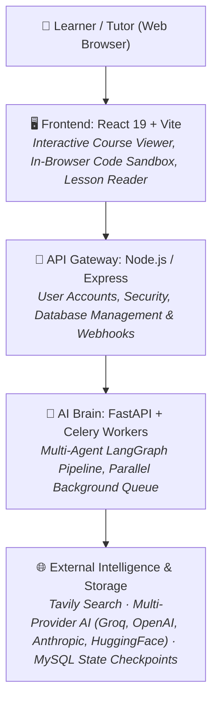
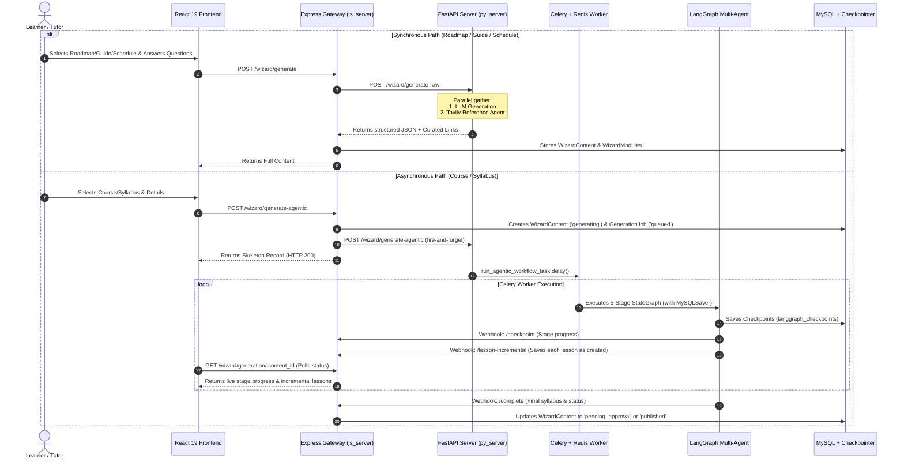
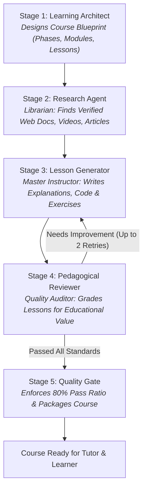
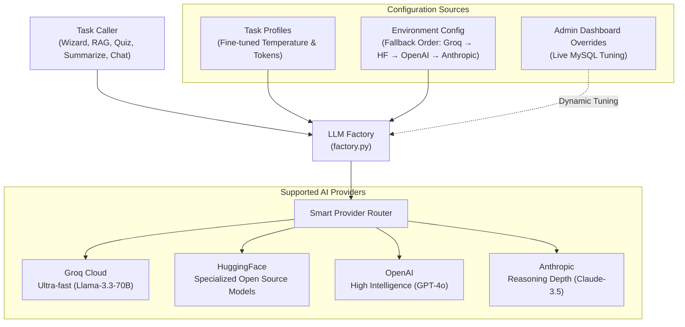

# 🧙‍♂️ CognitiveWizard: Content Generation & System Architecture Guide

> **A Plain-Language Executive Guide to How CognitiveWizard Creates AI-Powered Educational Courses, Roadmaps, and Learning Materials.**

---

## 📖 Executive Summary

Imagine hiring an entire digital university faculty—a **Curriculum Architect**, a **Research Librarian**, a **Master Instructor**, a **Pedagogical Reviewer**, and a **Quality Dean**—working simultaneously in seconds to design an interactive, comprehensive course tailored to any topic, goal, and skill level.

That is what **CognitiveWizard** does.

Instead of relying on simple, generic chat prompts that often produce shallow or inaccurate content, CognitiveWizard uses a **cooperative multi-agent AI system**. Each AI agent has a dedicated job, reviews each other's work, fetches real-world resources from the web, and ensures every single lesson meets strict pedagogical standards before delivering it to the learner.

---

## 🏛️ High-Level System Architecture

The platform operates across four coordinated layers:

### In Plain Terms:
1. **The Frontend (React 19)**: The modern, responsive classroom where learners read lessons, watch curated videos, run real Python/JavaScript code in their browser, and chat with an AI tutor.
2. **The API Gateway (Node.js/Express)**: The front-office security and coordination desk that manages user accounts, handles payments, tracks course progress in MySQL, and receives live updates from the AI engine.
3. **The AI Engine (Python/FastAPI & Celery)**: The background engine room where long-running course creation tasks run reliably without freezing the user's browser.
4. **The Databases & Services**: Cloud MySQL databases that track learning records and remember course generation progress, Redis for lightning-fast task queuing, and Tavily for real-time web research.

---

## ⚡ The Two Generation Tracks

CognitiveWizard provides two distinct generation experiences depending on what the user needs:

| Feature | 🚀 Quick Track (Roadmap / Guide / Schedule) | 🎓 Deep Track (Complete Interactive Course) |
| :--- | :--- | :--- |
| **Best For** | High-level timelines, revision guides, study calendars | Complete modular curriculums with full lessons & exercises |
| **Generation Time** | 5 to 15 seconds | 1 to 3 minutes (runs smoothly in background) |
| **Execution Model** | **Synchronous**: Instant generation with live web references | **Asynchronous**: 5-stage AI faculty with background Celery queue |
| **Depth** | Milestones, topics, key resources & PDF export | Phases → Modules → Lessons → Analogy, Code, Mistakes & Quizzes |
| **Crash Protection** | Instant return | **Durable Checkpointing**: Resumes automatically if interrupted |

---

## 🔄 End-to-End System Flow (Sequence Diagram)

This diagram shows exactly what happens under the hood when a user clicks "Generate":

---

## 🎓 Meet the AI Faculty: The 5-Stage Course Pipeline

When creating a full course, CognitiveWizard activates a **5-stage LangGraph workflow**. Each stage is handled by an AI specialist with a distinct role:

### Stage 1: The Learning Architect 🏗️
* **Real-World Role**: The Academic Dean who designs the curriculum blueprint.
* **What it does**: Takes the user's topic (e.g. *"Modern Machine Learning"*), target skill level (*Beginner*), and goal (*"Build vision apps"*), and drafts a logical modular structure: **Phases** (Foundations → Core → Advanced) broken into **Modules** and **Lessons**.
* **Why it matters**: It plans the whole journey before writing a single word of content, ensuring no prerequisite is skipped.

### Stage 2: The Research Agent 🔍
* **Real-World Role**: The University Research Librarian.
* **What it does**: Scours the live web using the **Tavily Search Engine** to find genuine, high-quality documentation, articles, and educational YouTube videos specifically matched to each lesson title.
* **Why it matters**: Guarantees that references and reading lists are real, active web resources rather than hallucinated or broken links.

### Stage 3: The Lesson Generator ✍️
* **Real-World Role**: The Inspiring Professor & Textbook Author.
* **What it does**: Crafts complete, in-depth lesson content for every topic. Each lesson includes:
  - **Core Concept & Detailed Explanations**
  - **Real-World Analogy** (e.g. explaining neural networks using a postal sorting facility)
  - **Executable Code Snippets**
  - **Common Mistakes & Misconceptions**
  - **Hands-On Exercises & Reflection Questions**
* **Incremental Saving**: Each lesson is saved to the database the moment it is finished. Learners don't have to wait for the whole course to complete before seeing early lessons.

### Stage 4: The Pedagogical Reviewer 🧐
* **Real-World Role**: The Educational Quality Assurance Board.
* **What it does**: Independently audits each generated lesson against strict educational criteria (Bloom's Taxonomy, depth, factual accuracy, and exercise quality).
* **Self-Correction Loop**: If a lesson is too brief or misses key objectives, the Reviewer flags it and sends it back to the Lesson Generator with specific instructions for revision (up to 2 automatic retries).

### Stage 5: The Quality Gate 🛡️
* **Real-World Role**: The Accreditation Inspector.
* **What it does**: Evaluates the course as a whole. It enforces an **80% passing threshold** across all lessons.
* **Result**: Once approved, it packages the syllabus, finalizes database transactions, and alerts the user that their course is ready to explore.

---

## 🛡️ Crash-Proof & Resilient Architecture

One of the biggest problems with AI systems is that long tasks often time out or get lost if a connection drops or a server restarts. CognitiveWizard was built specifically to eliminate this:

1. **Background Task Queue (Celery + Redis)**:
   - Course creation runs in a dedicated background worker.
   - Users can close their browser tab, step away, or turn off their laptop—the generation continues uninterrupted.
2. **Durable Database Checkpointing (`MySQLSaver`)**:
   - Every single agent step and lesson is recorded in MySQL (`langgraph_checkpoints`).
   - If the server restarts or an internet blip occurs, CognitiveWizard does **not** start over or re-spend AI credits. It reads the last checkpoint and picks up right where it left off.
3. **Automatic Startup Recovery (`resumePendingGenerations`)**:
   - Every time the system boots or a user logs in, CognitiveWizard automatically inspects pending jobs and resumes any stalled tasks.

---

## 🤖 How LLM Providers Are Managed

CognitiveWizard does not lock you into a single AI provider. It features an intelligent **LLM Provider Factory** that automatically routes requests to the fastest, healthiest, and most cost-effective AI model:

### Key Provider Management Highlights:
* **Multi-Vendor Failover**: Configured via `LLM_PROVIDER_ORDER`. If Primary (e.g. Groq) encounters rate limits or downtime, the system automatically and silently falls back to HuggingFace, OpenAI, or Anthropic.
* **Task-Tailored AI Personalities**: Different tasks need different AI behaviors:
  - *Tutor Chatbot & RAG*: Strict, factual, low temperature (`0.3`) to prevent hallucination.
  - *Quiz Generator*: High creativity and variance (`0.8`) for diverse questions.
  - *Lesson Authoring*: High token budget (`6,144 tokens`) to write rich, comprehensive textbooks.
  - *Pedagogical Reviewer*: Objective, deterministic grading (`0.2`).
* **Live Admin Controls**: Platform administrators can adjust model parameters, token budgets, and prompts directly from the Admin Dashboard without changing any source code.

---

## 💻 The Learner & Tutor Experience

When generation completes, learners and tutors are greeted by an interactive learning interface:

* **Course Viewer**: A collapsible sidebar organizing Phases, Modules, and Lessons with real-time completion tracking.
* **5-Tab Lesson Reader**:
  1. 📖 **Read**: Deep lesson text, formatted code blocks, analogies, and key takeaways.
  2. 🎥 **Watch**: Embedded YouTube tutorials and curated articles gathered by the Research Agent.
  3. 💻 **Code**: An in-browser code editor and runner powered by WebAssembly (Pyodide for Python, sandboxed engine for JavaScript)—no server setup needed.
  4. 🧪 **Practice**: Interactive multiple-choice questions, coding exercises, and self-reflection prompts.
  5. 💬 **Ask Tutor**: An in-context RAG chatbot grounded specifically in the lesson being studied.
* **Tutor Collaboration**: Tutors can review drafts, provide feedback to trigger AI revisions, or click **Publish Course** to release it to their students.

---

  CognitiveWizard © 2026 — Intelligent Curriculum & Adaptive Learning Platform

