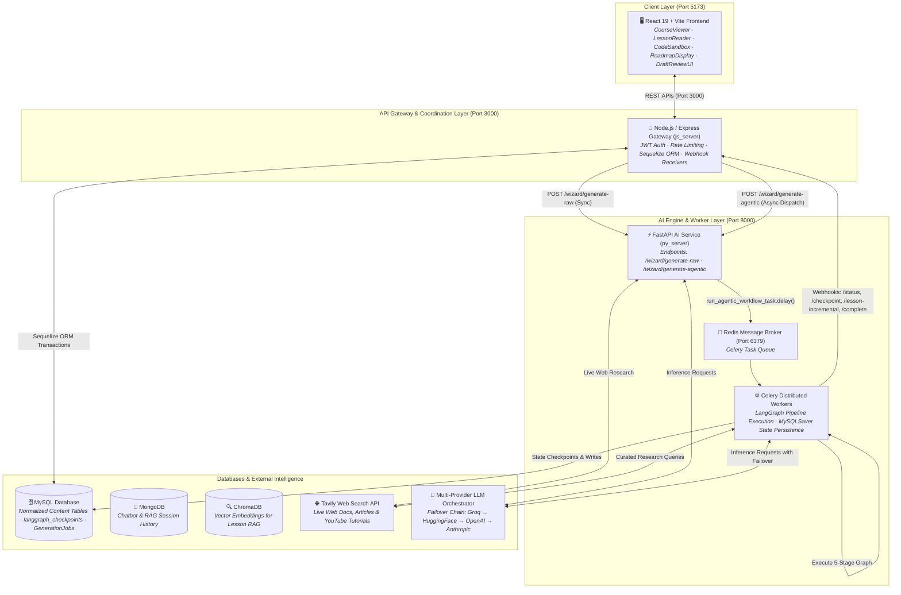
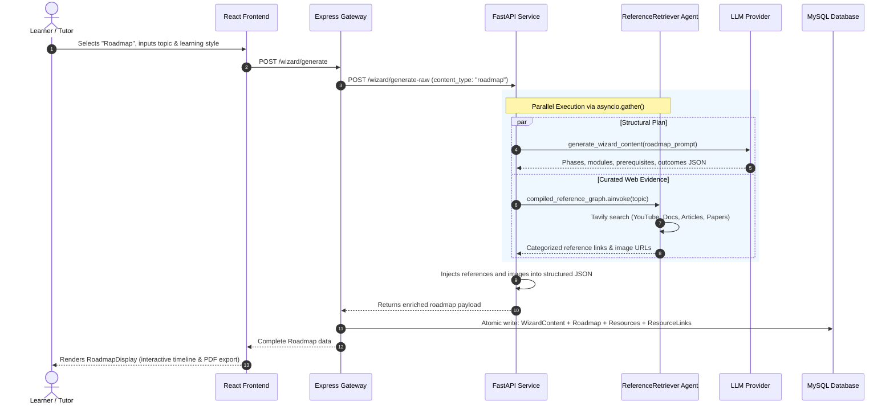
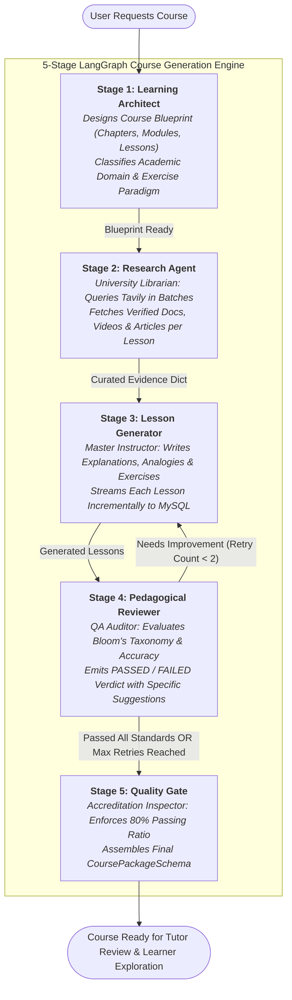
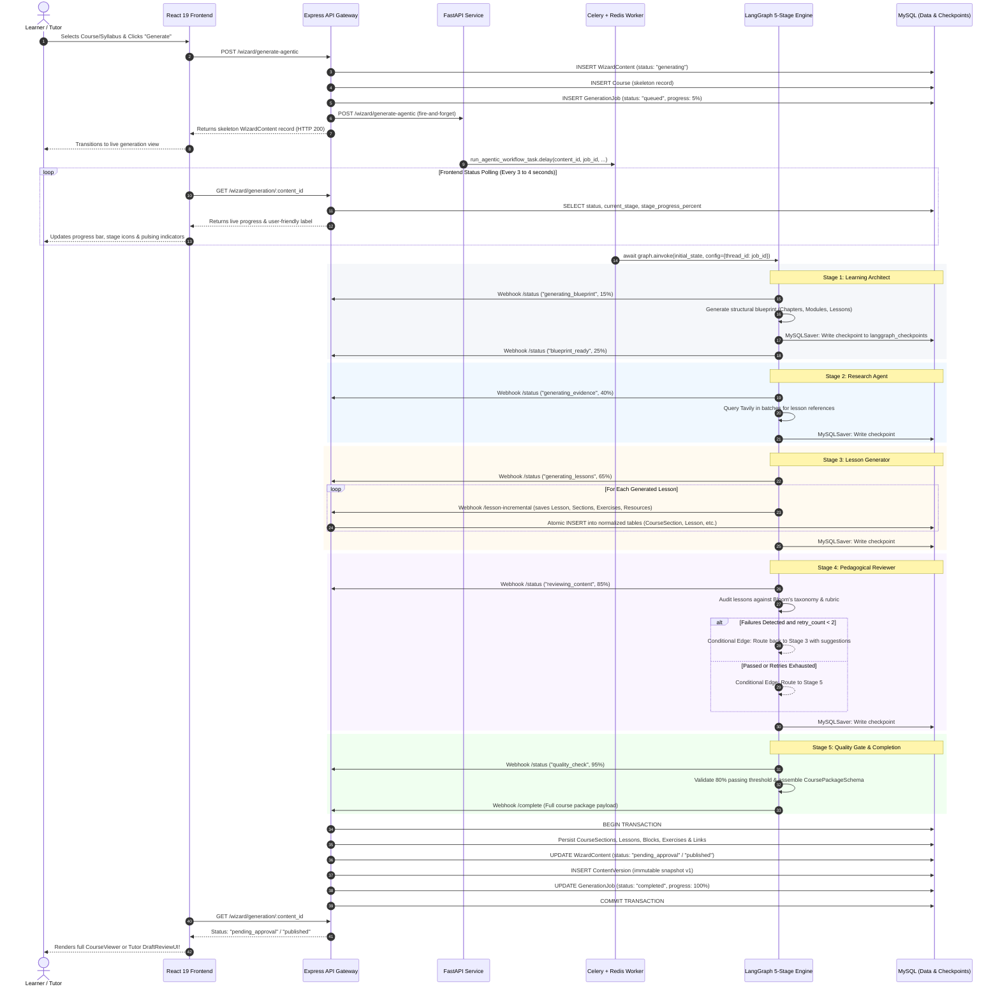
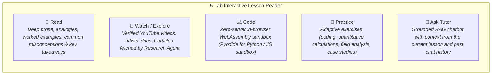

# 🧙‍♂️ CognitiveWizard: Content Generation & System Architecture Guide

> **A Comprehensive Technical & Operational Guide to How CognitiveWizard Generates AI-Powered Educational Courses, Roadmaps, and Practical Guides.**

---

## 📖 Executive Summary

Imagine assembling an entire digital university faculty—a **Curriculum Architect**, a **Research Librarian**, a **Master Instructor**, a **Pedagogical Reviewer**, and an **Accreditation Dean**—working simultaneously in seconds to design an interactive, comprehensive course tailored to any topic, goal, and skill level.

That is what **CognitiveWizard** achieves.

Instead of relying on single-shot generic prompts that often produce shallow, generic, or hallucinated content, CognitiveWizard employs a **cooperative multi-agent AI system** built on **LangGraph**, **FastAPI**, **Celery**, and **Node.js/Express**. Each agent has a dedicated domain responsibility: designing modular blueprints, gathering live web documentation via search engines, drafting rich multifaceted lessons, auditing educational rigor against Bloom's Taxonomy, and running quality gates before publishing.

The platform provides dedicated generation paths for three primary educational formats:
1. 🗺️ **Roadmaps**: High-level, milestone-based learning paths with visual timelines and verified web resources.
2. 📚 **Guides**: Practical step-by-step master handbooks with actionable tips, common mistakes, and reading estimates.
3. 🎓 **Courses / Syllabuses**: In-depth, interactive multi-chapter curriculums with analogies, real-world examples, in-browser code execution (WASM Pyodide/JS), adaptive practice exercises, and grounded RAG tutoring.

---

## 🏛️ High-Level System Architecture

CognitiveWizard is architected as a distributed four-tier system separating user interaction, API routing, asynchronous AI orchestration, and multi-database persistence:



### Architectural Responsibilities:

1. **Frontend (React 19, Vite, Tailwind CSS v4, Framer Motion)**:
   - Dynamic questionnaire based on content type (`WizardQuestionSet`).
   - Real-time polling of generation progress (`GET /wizard/generation/:content_id`) displaying live stage-by-stage visual status.
   - Interactive content rendering via specialized components: `RoadmapDisplay` (milestones & phases), `CourseViewer` (nested chapters & lessons), and `LessonReader` (5-tab interactive study view).
   - Zero-server in-browser code execution sandbox powered by WebAssembly (Pyodide for Python and iframe-isolated JavaScript).

2. **API Gateway (Node.js, Express, Sequelize ORM)**:
   - Authentication, authorization, and role management (Learners vs. Tutors).
   - Directs synchronous requests (Roadmaps & Guides) to FastAPI and returns immediately.
   - Dispatches asynchronous Course jobs, creating initial records in `wizard_contents`, `wizard_courses`, and `wizard_generation_jobs`.
   - Ingests internal webhooks from Celery workers: `/status`, `/checkpoint`, `/lesson-incremental`, and `/complete`.
   - Enforces atomic database transactions and manages automatic recovery on startup or login (`resumePendingGenerations`).

3. **AI Engine & Distributed Workers (Python 3.11+, FastAPI, Celery, Redis)**:
   - **FastAPI**: Lightweight, asynchronous REST interface bridging the Node.js gateway to AI services.
   - **Celery + Redis**: Industrial-grade task queue preventing web request timeouts during long-running multi-minute agent pipelines.
   - **LangGraph Multi-Agent Engine**: State machine orchestrating specialized agent nodes, conditional retry edges, and checkpointed state saves.
   - **Multi-Provider LLM Router**: Automatic provider failover chain (`Groq` → `HuggingFace` → `OpenAI` → `Anthropic`) protecting against rate limits (HTTP 429) or provider outages.

4. **Persistence & External Services**:
   - **MySQL**: Normalized relational storage for courses, sections, lessons, exercises, resources, and binary agent state dumps (`langgraph_checkpoints` & `langgraph_writes`).
   - **Tavily Search API**: Live web search engine used to extract real-world documentation, tutorials, and YouTube videos.
   - **MongoDB & ChromaDB**: In-context RAG chatbot support for lesson-grounded tutoring.

---

## ⚡ The Three Generation Tracks

CognitiveWizard tailors its generation strategy based on the depth and pedagogical requirements of each content type:

| Attribute | 🗺️ Roadmap | 📚 Guide | 🎓 Course / Syllabus |
| :--- | :--- | :--- | :--- |
| **Primary Goal** | High-level timeline, prerequisites & learning trajectory | Step-by-step master handbook with practical actions | Full modular curriculum with deep lessons & exercises |
| **Execution Model** | **Synchronous Concurrent** (`asyncio.gather`) | **Synchronous Single-Shot** | **Asynchronous Distributed** (Celery + LangGraph) |
| **Generation Latency** | 5 to 15 seconds | 5 to 12 seconds | 2 to 6 minutes (runs smoothly in background) |
| **Agent Involvement** | LLM Generator + `ReferenceRetriever` Agent (Tavily) | Dedicated LLM Prompt Builder | 5-Stage Multi-Agent Faculty + Self-Correction Loop |
| **Web Research** | Parallel web search for YouTube, articles & docs | Inlined best practices & tools | Per-lesson compound search across all chapters |
| **Database Storage** | `wizard_roadmaps` + `wizard_resources` | `wizard_guides` + `wizard_resources` | Full relational hierarchy: `Course` → `Section` → `Lesson` → `Blocks` |
| **Crash Protection** | Request retry | Request retry | **Durable Checkpoints (`MySQLSaver`)** + Auto-Resume |
| **Interactive UX** | Milestone graph, phase cards, ReportLab PDF export | Expandable step modules, tools list, pitfalls | 5-tab lesson reader, in-browser WASM code runner, RAG tutor |

> [!NOTE]
> **Legacy Content Types**: Previous iterations supported a generic `Schedule` content type. This has been deprecated and replaced by structured Roadmaps (for milestone planning) and full Courses (for comprehensive study).

---

## 🔍 How Roadmaps & Guides Are Generated (Quick Track)

### 1. The Roadmap Workflow (Parallel Agentic Enrichment)

Roadmaps deliver visual learning paths from novice to mastery. To ensure links and resources are verified rather than hallucinated, the roadmap pipeline executes two parallel processes:



#### Key Technical Highlights for Roadmaps:
- **`asyncio.gather` Concurrency**: The structural LLM generation and Tavily web research execute concurrently, capping generation latency to the slowest single operation (typically under 10 seconds).
- **Categorized Resources**: The `ReferenceRetriever` agent groups verified links into `youtube`, `official_docs`, `article`, `course`, and `research_paper`.
- **PDF Export Engine**: Learners can click **Export PDF** to trigger `POST /wizard/export-pdf`. The Python backend leverages **ReportLab** (`generate_roadmap_pdf`) to format the roadmap into a professional, printable document.

---

### 2. The Guide Workflow (Practical Master Handbooks)

Guides provide clear, sequential instructions for mastering a specific technique, tool, or concept.

1. **Prompt Construction**: `build_wizard_prompt` specifies the target audience, skill level, and detailed instructions for actionable steps, prerequisites, required tools, common pitfalls, and estimated reading times.
2. **Schema Enforcement**: Output is validated against the guide schema (`summary`, `reading_time_minutes`, `tools_required`, `modules` with `tips` and `common_mistakes`).
3. **Normalized Persistence**: Saved into `wizard_contents` with a dedicated 1:1 row in `wizard_guides`.
4. **Interactive Display**: Rendered on the frontend using expandable step cards, allowing learners to check off steps as they complete them.

---

## 🎓 How Courses Are Generated: The 5-Stage Multi-Agent Pipeline

When generating a full course, CognitiveWizard activates an asynchronous, durable **LangGraph StateGraph** orchestrated by **Celery background workers**.



---

### Detailed Stage Breakdown

#### 🏗️ Stage 1: The Learning Architect Node (`learning_architect_node`)
- **Real-World Role**: The Academic Dean who designs the curriculum blueprint.
- **What it does**: Takes the user's topic, skill level, goal, and target audience, and designs a comprehensive, multi-chapter course blueprint without writing any lesson prose.
- **Domain & Exercise Paradigm Classification**:
  The Architect automatically classifies the topic into an academic domain and determines the appropriate exercise style:

  | Identified Domain | Example Topics | Exercise Paradigm | Exercise Behavior in Lessons |
  | :--- | :--- | :--- | :--- |
  | `computer_science` | Python, React, Algorithms, SQL | `coding` | Hands-on code snippets + in-browser `starter_code` |
  | `natural_sciences` | Geology, Biology, Chemistry, Astronomy | `analysis` | Scientific scenario analysis, sample identification |
  | `engineering` | Mechanical, Electrical, Civil, Physics | `calculation` | Quantitative problem-solving with numerical formulas |
  | `business_finance` | Marketing, Corporate Finance, Management | `case_study` | Real-world business dilemmas and strategic choices |
  | `humanities` | History, Philosophy, Literature, Law | `reflection` | Conceptual analysis, ethical debates, reflection prompts |
  | `medicine` | Anatomy, Nursing, Clinical Diagnostics | `case_study` | Clinical patient cases and diagnostic evaluation |

- **Bloom's Taxonomy Objectives**: Every lesson is assigned 2 to 4 measurable learning objectives starting with action verbs (*"Analyze..."*, *"Implement..."*, *"Evaluate..."*).
- **Blueprint-First Efficiency**: By generating structure first, the system establishes a clear roadmap before spending computational resources on deep lesson generation.
- **Checkpoints**: Emits status webhook `generating_blueprint` → `blueprint_ready`. Caches the blueprint to MySQL for crash protection.

---

#### 🔍 Stage 2: The Research Agent Node (`research_agent_node`)
- **Real-World Role**: The University Research Librarian.
- **What it does**: Traverses the blueprint tree, extracts all lesson titles, and constructs compound queries (`Course Title — Module Title — Lesson Title`).
- **Parallel Batching**: Uses the `ReferenceRetriever` service to search Tavily in concurrent batches of 10 lessons at a time (capped at 4 verified sources per category) to optimize latency while respecting rate limits.
- **Fault-Tolerant Soft Fails**: If external network issues occur for a particular query, the node logs a warning and returns an empty evidence list for that lesson. The pipeline continues smoothly rather than failing the entire course.
- **Checkpoints**: Emits status webhook `generating_evidence`.

---

#### ✍️ Stage 3: The Lesson Generator Node (`lesson_generator_node`)
- **Real-World Role**: The Master Instructor & Subject Specialist.
- **What it does**: Writes full, deeply engaging lessons based on the blueprint and curated research evidence.
- **Lesson Anatomy**: Every lesson adheres to a strict 6-part pedagogical structure:
  1. **Overview**: 2–4 sentence summary highlighting what the student will master.
  2. **Core Explanation**: Thorough explanation of the concept (minimum 150 words) with clear definitions.
  3. **Real-World Analogy**: Intuitive relatable analogy (e.g., explaining transformer attention using an orchestra conductor).
  4. **Worked Example / Case Study**: Practical real-world demonstration.
  5. **Executable Code / Method**: Working code snippet (strictly omitted if the lesson is purely theoretical/historical).
  6. **Common Mistakes**: 2–3 common pitfalls or misconceptions and how to avoid them.
  7. **Key Takeaways**: Bullet-point summary recapping core ideas.
  8. **Adaptive Practice Exercises**: 1–2 exercises matching the domain's paradigm (coding challenge with starter code, quantitative problem, or case reflection).
- **Theoretical vs. Hands-On Adaptation**:
  The generator automatically detects theoretical or historical lessons (e.g., *"History of Machine Learning"* or *"Ethics in AI"*). In these lessons, it automatically suppresses code blocks and replaces coding challenges with thought-provoking conceptual Q&A or analysis scenarios.
- **⚡ Real-Time Incremental Saving**:
  As each lesson finishes, the generator fires an incremental webhook (`POST /internal/wizard-webhook/lesson-incremental`) directly to the Express gateway. The gateway immediately commits the section, lesson, exercises, and resource links into MySQL. **Learners polling the course can view lessons appearing in real time before the full course is finished!**
- **Checkpoints**: Emits status webhook `generating_lessons`.

---

#### 🧐 Stage 4: The Pedagogical Reviewer Node (`pedagogical_reviewer_node`)
- **Real-World Role**: The Quality Assurance Auditor & Review Board.
- **What it does**: Independently evaluates each generated lesson against an educational checklist:
  - **Factual Accuracy**: Are core principles explained accurately without hallucinations?
  - **Objective Coverage**: Does the content directly fulfill the learning objectives set by the Architect?
  - **Exercise Integrity**: Are exercises aligned, solvable, and domain-appropriate?
  - **Bloom's Taxonomy Progression**: Identifies whether the lesson covers *Remember*, *Understand*, *Apply*, and *Analyze* levels.
- **Fairness for Non-Coding Topics**: The reviewer explicitly prevents penalizing theoretical or conceptual lessons for lacking code blocks.
- **🔁 Self-Correction Feedback Loop**:
  If a lesson fails the pedagogical review:
  1. The reviewer produces specific issues and actionable suggestions.
  2. The LangGraph conditional edge `_should_retry_or_gate` inspects the state.
  3. If `retry_count < 2`, the graph **routes execution back to the Lesson Generator**.
  4. The Lesson Generator regenerates *only* the failed lessons, specifically addressing the reviewer's critique.
  5. If retries are exhausted or all lessons pass, execution proceeds to the Quality Gate.
- **Checkpoints**: Emits status webhook `reviewing_content`.

---

#### 🛡️ Stage 5: The Quality Gate Node (`quality_gate_node`)
- **Real-World Role**: The Accreditation Dean.
- **What it does**: Performs final schema validation across all course modules, checks that each lesson has valid content and citations, and calculates the overall course passing ratio.
- **80% Threshold Enforcement**: Enforces that at least 80% of lessons have passed the pedagogical review.
- **Package Assembly**: Combines the structural blueprint, generated lesson sections, domain metadata, and citations into a unified `CoursePackageSchema`.
- **Final Hand-off**: Fires `POST /internal/wizard-webhook/complete` to the Express API Gateway, triggering final database commits, job completion, and user notification.
- **Checkpoints**: Emits status webhook `quality_check` → `completed`.

---

## 🔄 End-to-End System Sequence Diagram

This sequence diagram details the exact interactions between the browser, API Gateway, FastAPI AI service, Celery worker, LangGraph nodes, and MySQL database:



---

## 🗄️ Normalized Database Architecture

CognitiveWizard stores generated content in a structured, relational schema designed for fast queries, fine-grained progress tracking, and atomic updates:

```text
wizard_contents (Root metadata, topic, title, status, skill_level, user_id)
│
├── 1:1 wizard_roadmaps (Milestones, phases, learning style, graph data)
│         └── Polymorphic wizard_resources ── 1:N wizard_resource_links
│
├── 1:1 wizard_guides (Summary, reading time, tools required, body markdown)
│         └── Polymorphic wizard_resources ── 1:N wizard_resource_links
│
├── 1:1 wizard_courses (Domain, domain_label, exercise_paradigm, total counters)
│         └── 1:N wizard_course_sections (Chapters and thematic modules)
│                   └── 1:N wizard_lessons (Individual lesson items)
│                             ├── 1:N wizard_lesson_sections (Explanation, Analogy, Code, Mistakes, Summary)
│                             ├── 1:N wizard_lesson_exercises (Coding, Calculation, Case Study, Reflection)
│                             └── 1:N wizard_resources ── 1:N wizard_resource_links
│
├── 1:N wizard_generation_jobs (Thread ID, Celery status, progress %, user error messages)
├── 1:N wizard_content_versions (Immutable historical snapshots for rollbacks & tutor revisions)
└── 1:N wizard_content_metadata (Key-value extended properties)

Durable Agent Checkpoints (Managed by PyMySQL MySQLSaver):
├── langgraph_checkpoints (Binary snapshots of complete agent state after each node)
└── langgraph_writes (Channel-level incremental writes for pending graph operations)
```

---

## 🛡️ Crash-Proof & Resilient Infrastructure

Long-running generative workflows are susceptible to network disconnects, browser closes, rate limits, and server restarts. CognitiveWizard implements five defensive layers to guarantee zero lost progress:

### 1. Celery + Redis Distributed Worker Queue
- Course creation executes completely independent of HTTP client connections.
- Users can close their browser, shut down their computer, or lose connection—the Celery worker continues executing in the background until the job is completed.

### 2. Durable MySQL State Checkpointing (`MySQLSaver`)
- The pipeline uses a custom `MySQLSaver` implementing LangGraph's `BaseCheckpointSaver`.
- After every node execution, the complete `CourseAgentState` is serialized and saved to `langgraph_checkpoints` and `langgraph_writes`.
- When recovering, Celery calls `await graph.aget_state(config)`. If a prior state exists, it calls `await graph.ainvoke(None, config)` to **resume immediately from the last completed node without repeating previous LLM calls or re-spending AI credits**.

### 3. Multi-Provider LLM Failover (`get_llm_for_course_task`)
- If the primary provider (e.g., Groq) triggers a rate limit (HTTP 429) or outage, LangChain's `with_fallbacks` dynamically cascades execution through configured providers:
  $$\text{Groq} \longrightarrow \text{HuggingFace} \longrightarrow \text{OpenAI} \longrightarrow \text{Anthropic}$$
- Celery tasks catch `AllProvidersFailedError` and perform exponential backoff retries with user-friendly notification messages.

### 4. Deadlock-Resistant Incremental Writing
- When concurrent workers write incremental lessons to MySQL, transient row locks can occur. The webhook controller handles database deadlocks (MySQL error `1213`) using an automatic 3-attempt exponential retry loop with jitter (`attempt * 100ms`).

### 5. Automatic Startup & Login Recovery (`resumePendingGenerations`)
- On Express server boot (`index.js`) and whenever a user logs in (`authController.js`), `resumePendingGenerations()` automatically queries `wizard_generation_jobs` for any stalled jobs from the last 48 hours and re-enqueues them to Celery.

---

## 💻 The Tutor & Learner Experience

### 👨‍🏫 Tutor Collaboration & Draft Review Flow

When a course is generated by an instructor or tutor, it is initially placed in `pending_approval` status:

1. **Draft Review Interface (`DraftReviewUI`)**:
   - Tutors can inspect all chapters, modules, explanations, code snippets, and exercises.
   - Review pedagogical audit scores and Bloom's taxonomy tags.
2. **AI-Powered Course Regeneration (`POST /wizard/regenerate-agentic`)**:
   - If changes are needed, tutors submit qualitative feedback (e.g., *"Add more practical case studies on deep neural network optimization and simplify the math in Module 2"*).
   - The `learning_architect_node` activates in **feedback-aware mode**, reading the existing blueprint and tutor feedback to regenerate a refined curriculum while preserving strong existing sections.
3. **One-Click Publishing (`POST /wizard/:content_id/publish`)**:
   - Releases the course to students, changing its status to `published`.

---

### 🧑‍🎓 Interactive Learner Classroom

When studying a course, learners interact with a rich 5-tab learning interface:



1. 📖 **Read**: Comprehensive, formatted lesson content with syntax-highlighted code blocks, real-world analogies, and misconception warnings.
2. 🎥 **Watch / Explore**: Verified external tutorials and documentation curated by the Research Agent.
3. 💻 **Code**: Fully functional, zero-server code execution sandbox powered by **Pyodide (WebAssembly)** for Python and an isolated iframe runner for JavaScript. Learners run and test code with zero latency and no backend compute costs.
4. 🧪 **Practice**: Interactive exercises matching the domain's exercise paradigm (running code tests, entering calculations, or answering conceptual reflection prompts).
5. 💬 **Ask Tutor**: An in-context AI tutor powered by **ChromaDB vector embeddings** and **MongoDB session memory**, grounded strictly in the lesson currently being viewed.

---

## 📡 Complete API Reference: Generation & Webhooks

### User-Facing Endpoints

| Method | Endpoint | Description |
| :--- | :--- | :--- |
| `POST` | `/api/wizard/generate` | Generates non-course content (Roadmap, Guide) synchronously. |
| `POST` | `/api/wizard/generate-agentic` | Initiates asynchronous 5-stage course generation via Celery. |
| `GET` | `/api/wizard/generation/:content_id` | Polls live generation status, progress percentage, stage, and messages. |
| `GET` | `/api/wizard/:content_id` | Fetches complete course hierarchy, roadmap, or guide with all resources. |
| `GET` | `/api/wizard/:content_id/lesson/:lesson_id` | Fetches specific lesson details, sections, exercises, and resources. |
| `POST` | `/api/wizard/:content_id/publish` | Approves and publishes a course draft for student access. |
| `POST` | `/api/wizard/export-pdf` | Generates and downloads a formatted PDF document of a roadmap. |
| `GET` | `/api/wizard/question-sets` | Fetches dynamic questionnaire configurations for roadmaps, guides, and courses. |

### Internal Agent Webhooks (`/internal/wizard-webhook/*`)

| Endpoint | Sender | Purpose |
| :--- | :--- | :--- |
| `POST /status` | LangGraph Nodes | Updates current stage label and progress percentage in `GenerationJob`. |
| `POST /checkpoint` | LangGraph Nodes | Records granular node checkpoint transitions in `GenerationJob.checkpoint_data`. |
| `POST /lesson-incremental` | Lesson Generator | Streams and persists each completed lesson directly to MySQL in real time. |
| `POST /complete` | Quality Gate | Delivers the final `CoursePackageSchema` and triggers the atomic persistence transaction. |
| `POST /job/:job_id/retry` | System Admin | Manually triggers resumption of an interrupted or failed generation job. |
| `POST /job/:job_id/cancel` | System Admin | Revokes the Celery task and cancels generation. |

---

<div align="center">
  <sub>CognitiveWizard © 2026 — Intelligent Multi-Agent Curriculum & Adaptive Learning Platform</sub>
</div>
