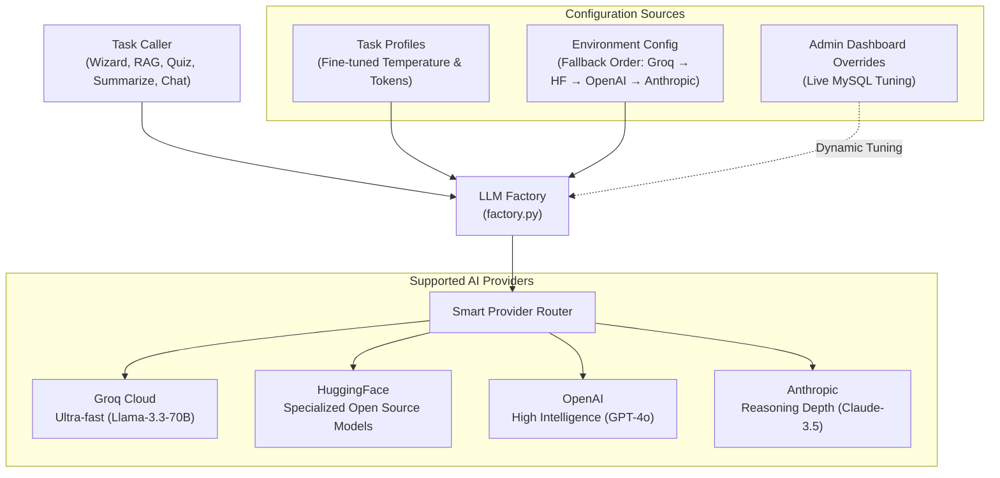

## 🤖 How LLM Providers Are Managed

CognitiveWizard does not lock you into a single AI provider. It features an intelligent **LLM Provider Factory** that automatically routes requests to the fastest, healthiest, and most cost-effective AI model:

### Key Provider Management Highlights:

- **Multi-Vendor Failover**: Configured via `LLM_PROVIDER_ORDER`. If Primary (e.g. Groq) encounters rate limits or downtime, the system automatically and silently falls back to HuggingFace, OpenAI, or Anthropic.
- **Task-Tailored AI Personalities**: Different tasks need different AI behaviors:
  - _Tutor Chatbot & RAG_: Strict, factual, low temperature (`0.3`) to prevent hallucination.
  - _Quiz Generator_: High creativity and variance (`0.8`) for diverse questions.
  - _Lesson Authoring_: High token budget (`6,144 tokens`) to write rich, comprehensive textbooks.
  - _Pedagogical Reviewer_: Objective, deterministic grading (`0.2`).
- **Live Admin Controls**: Platform administrators can adjust model parameters, token budgets, and prompts directly from the Admin Dashboard without changing any source code.

---

  CognitiveWizard © 2026 — Intelligent Curriculum & Adaptive Learning Platform

