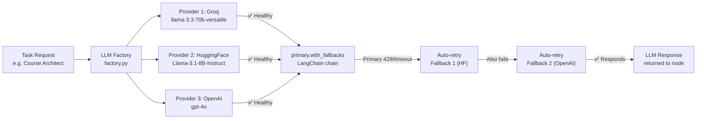
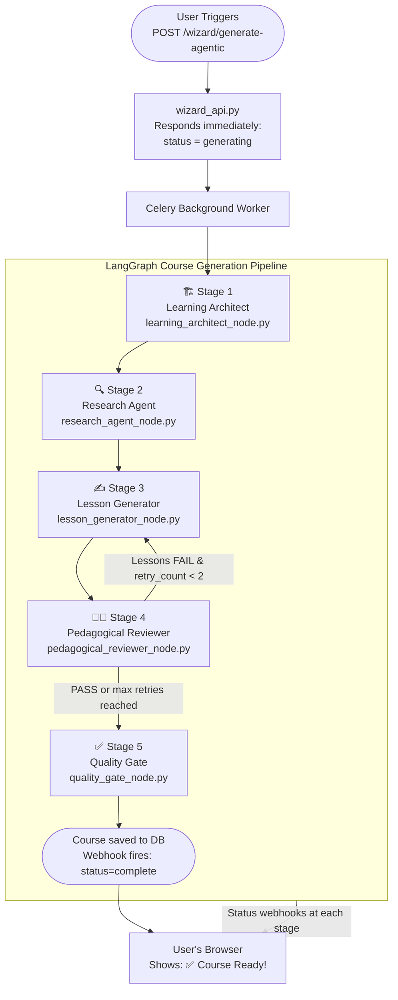
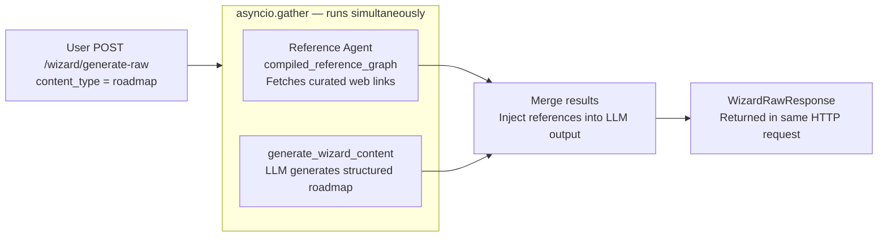

# 🧙‍♂️ CognitiveWizard — AI Wizard Module: Architecture & Generation Flow

## 📋 Table of Contents

1. [Big Picture — What the Wizard Does](#1-big-picture--what-the-wizard-does)
2. [Three Generation Modes](#2-three-generation-modes)
3. [The LLM Provider System — Your AI Engine Room](#3-the-llm-provider-system--your-ai-engine-room)
4. [The Course Generation Pipeline — Deep Dive](#4-the-course-generation-pipeline--deep-dive)
5. [Guide & Roadmap Generation — Simple Path](#5-guide--roadmap-generation--simple-path)
6. [Real-Time Status Webhooks](#6-real-time-status-webhooks)
7. [Configuring LLM Providers](#7-configuring-llm-providers)
8. [Key Files Reference](#8-key-files-reference)

---

## 1. Big Picture — What the Wizard Does

Think of the **AI Wizard** as a team of specialist AIs sitting inside the platform. When a user asks for a learning resource — say "create me a Python course for beginners" — the Wizard:

1. **Understands the request** (topic, skill level, learning style, goal).
2. **Picks the right AI specialists** from a pool of available AI providers (Groq, HuggingFace, OpenAI, Anthropic).
3. **Runs those specialists in a pipeline**, each doing a focused job.
4. **Delivers a fully structured result** (course, roadmap, or guide) back to the user's screen.

The magic is that the user sees a progress bar and live status updates while all of this happens in the background.

---

## 2. Three Generation Modes

| Content Type        | What it produces                                                               | How it is generated                                            |
| ------------------- | ------------------------------------------------------------------------------ | -------------------------------------------------------------- |
| **Guide / Roadmap** | A structured learning path with phases, milestones and curated references      | Single LLM call + Reference Agent running _in parallel_        |
| **Course**          | A full multi-chapter course: blueprint → researched lessons → reviewed content | 5-stage agentic pipeline (runs as a background job via Celery) |

```
User Request
     │
     ▼
[wizard_api.py]
     │
     ├─ content_type = "roadmap/guide" ──► [Simple Path]  → LLM + Reference Agent (concurrent)
     │
     └─ content_type = "course"        ──► [Agentic Path] → 5-Stage Pipeline via Celery background job
```

---

## 3. The LLM Provider System — Your AI Engine Room

> **Non-tech analogy**: Think of this like ordering food via a delivery app. You don't care which restaurant kitchen prepares your burger — you just want the best burger, fast. If Restaurant A is closed, the app automatically routes to Restaurant B. The **LLM Provider System** is that routing app.

### Can Different Providers Use Different Models? ✅

**Yes — absolutely, and this is a core design feature.**

Each AI provider (Groq, HuggingFace, OpenAI, Anthropic) runs its own independently configured default model. You set them via environment variables:

```env
# Groq uses its own fast inference model
GROQ_DEF_MODEL=llama-3.3-70b-versatile

# HuggingFace uses a different open-source model
HF_DEF_MODEL=meta-llama/Llama-3.1-8B-Instruct

# OpenAI uses GPT-4o
OPENAI_DEF_MODEL=gpt-4o

# Anthropic uses Claude
ANTHROPIC_DEF_MODEL=claude-3-5-sonnet-20241022
```

When the system needs an LLM, it tries providers in the order you configured (e.g., `groq → huggingface → openai`). The **Groq** attempt uses `llama-3.3-70b-versatile`; if it fails and falls back to **HuggingFace**, that attempt uses `Llama-3.1-8B-Instruct`. The caller never needs to know which one eventually answered.

**Is this a good approach?** ✅ **Yes — here is why:**

- Different providers excel at different things: speed (Groq), cost-free open-source (HuggingFace), highest intelligence (OpenAI, Anthropic).
- You are not locked into one vendor. If Groq raises prices or hits limits, you change one line in `.env`.
- A per-task `model_override` field in `llm_configs.py` also lets you pin a _specific model_ for one task type, overriding the provider default entirely (e.g., the quiz generator always uses a specific Llama model regardless of which provider is active).

---

### Task Profiles — Tuning the AI per Job

Every feature that calls the AI does not just say "give me an LLM." It says **"give me an LLM configured for _this specific job_."** That configuration is a **Task Profile**.

| Task                     | Temperature | Max Tokens | Why tuned this way                            |
| ------------------------ | ----------- | ---------- | --------------------------------------------- |
| `chat`                   | 0.5         | 1024       | Balanced conversational replies               |
| `rag`                    | 0.3         | 1024       | Factual, grounded — low hallucination risk    |
| `summarize`              | 0.3         | 1024       | Deterministic summaries                       |
| `quiz`                   | 0.8         | 2500       | Creative, varied questions + long JSON output |
| `wizard` (guide/roadmap) | 0.6         | 3000       | Balanced creativity for roadmaps              |
| `course_architect`       | 0.4         | 4096       | Structured blueprint, moderate creativity     |
| `course_lesson`          | 0.6         | 6144       | Rich textbook-quality lesson content          |
| `course_reviewer`        | 0.2         | 2048       | Objective PASS/FAIL grading                   |
| `course_quality`         | 0.1         | 1024       | Tight, strict final validation                |

> **Temperature explained simply**: 0.1 = robot-strict, highly consistent. 0.9 = very creative, less predictable. For writing a quiz you want variety (high temp); for grading lessons you want consistency (low temp).

These profiles live in [`providers/llm/llm_configs.py`](../server/py_server/providers/llm/llm_configs.py).

---

### How the Router Works — Step by Step

```
A pipeline node (e.g. Learning Architect) calls:
    get_llm_for_course_task(TaskType.COURSE_ARCHITECT)
           │
           ▼
    [factory.py] get_llm_for_course_task()
           │
           ├─ Reads LLM_PROVIDER_ORDER from settings (from .env)
           │   e.g. "groq,huggingface,openai"
           │
           ├─ For each provider name in order:
           │     → get_llm_for_task(task, provider=provider_name)
           │         → Reads Task Profile (temperature, max_tokens, model_override)
           │         → Instantiates Provider(provider=..., model_name=...)
           │         → Provider.get_llm() returns LangChain LLM object
           │
           ├─ Collects all healthy LLMs: [(groq_llm), (hf_llm), (openai_llm)]
           │
           └─ Returns:
               primary_llm.with_fallbacks([hf_llm, openai_llm])
                  ▲
                  └─ LangChain built-in: if primary fails at inference time,
                     it automatically retries with each fallback in order.
```

If **all** providers fail to even initialize, `AllProvidersFailedError` is raised — the only error that surfaces to the user as a hard failure.

---

### Multi-Provider Failover



**Error types** (from [`provider_errors.py`](../server/py_server/providers/llm/provider_errors.py)):

| Exception                  | Meaning                                                           | Action taken                        |
| -------------------------- | ----------------------------------------------------------------- | ----------------------------------- |
| `ProviderUnavailableError` | Provider server unreachable (5xx, timeout)                        | Skip, try next provider             |
| `ModelError`               | Provider reached but model invocation failed (bad JSON, OOM, 4xx) | Skip, try next provider             |
| `AllProvidersFailedError`  | Every configured provider failed                                  | Surfaces `status=error` to the user |

---

## 4. The Course Generation Pipeline — Deep Dive

> **Non-tech analogy**: Imagine writing a university course. You would not sit down and write everything in one go. You would first design the curriculum structure (what chapters?), then have a researcher gather resources, then have writers author each lesson, then have a dean review them, then a final quality check before publishing. That is _exactly_ what this pipeline does — but with AI specialists.

The pipeline is a **LangGraph StateGraph** — a stateful directed graph where each node processes data and passes it along via a shared state object (`CourseAgentState`).

### Full Pipeline Flow



The **shared state** that flows through every node is defined in [`course_agent_state.py`](../server/py_server/agents/states/course_agent_state.py). Each node only reads the fields it needs and only writes the fields it produces. LangGraph merges them automatically.

---

### Stage 1 · Learning Architect

**File**: [`learning_architect_node.py`](../server/py_server/agents/nodes/learning_architect_node.py)

**Plain English**: _"Design the table of contents. What chapters? What modules? What are the learning objectives for each lesson?"_

Key behaviours:

- Does **NOT** write any lesson content — purely structural, fast and cheap first pass.
- Uses `COURSE_ARCHITECT` task profile: temperature 0.4, up to 4 096 tokens.
- Validates output against `CourseBlueprintSchema` (Pydantic). Falls back gracefully if schema validation fails.
- Saves a **checkpoint** to MySQL so the job can be resumed if the server crashes mid-run.
- Fires `generating_blueprint` status webhook → user sees _"🏗️ Designing your course structure..."_.
- If `state.feedback` is set (regeneration flow), the prompt is modified to incorporate tutor feedback on the existing blueprint.

**Output added to state**: `course_blueprint` — chapters → modules → lesson titles + objectives.

---

### Stage 2 · Research Agent

**File**: [`research_agent_node.py`](../server/py_server/agents/nodes/research_agent_node.py)

**Plain English**: _"For each lesson we are going to write, gather supporting evidence — key concepts, references, real resources — so the lesson writers have material to work from."_

Key behaviours:

- Reads `course_blueprint` from state.
- Produces `lesson_evidence`: `{ "lesson_title": [ResourceItem, ...] }`.
- Feeds Stage 3 so lessons are grounded in research, not written in a vacuum.

---

### Stage 3 · Lesson Generator

**File**: [`lesson_generator_node.py`](../server/py_server/agents/nodes/lesson_generator_node.py)

**Plain English**: _"Write the actual lesson content — explanations, analogies, code examples, common mistakes, practice exercises, and a summary — for every lesson in the blueprint."_

Key behaviours:

- Most resource-intensive stage. Uses `COURSE_LESSON` profile: temperature 0.6, up to **6 144 tokens** per lesson.
- Processes lessons in small concurrent batches (controlled by `_LESSON_BATCH_SIZE`) to respect API rate limits.
- **Soft-fail per lesson**: if one lesson's LLM call fails, that lesson is marked with a warning and skipped — the rest of the course continues. The pipeline never crashes from a single lesson failure.
- Sends an **incremental webhook** after each lesson → UI can show partial content appearing progressively.
- On retry (coming back from Stage 4), re-generates _only_ the failed lessons, preserving the already-passed ones.
- Validates each lesson against `CourseLessonSchema`.

---

### Stage 4 · Pedagogical Reviewer

**File**: [`pedagogical_reviewer_node.py`](../server/py_server/agents/nodes/pedagogical_reviewer_node.py)

**Plain English**: _"A dean of academics reviews every lesson. Does it have clear objectives? Does it scaffold knowledge properly? Does it hit the right cognitive levels? PASS or FAIL — with specific improvement notes."_

Key behaviours:

- Uses `COURSE_REVIEWER` profile: temperature 0.2 — very deterministic grading.
- Bloom's Taxonomy levels checked: Remember → Understand → Apply → Analyze.
- Issues structured `PASS` / `FAIL` verdict per lesson with actionable suggestions.
- **Retry loop**: If any lesson fails AND `retry_count < 2`, the LangGraph conditional edge routes _back_ to Stage 3 to re-generate _only_ the failing lessons.
- After 2 retries, whatever results exist are forwarded to Stage 5 regardless.
- The reviewer never forces a PASS — it only ever sends honest verdicts to maintain academic integrity.

---

### Stage 5 · Quality Gate

**File**: [`quality_gate_node.py`](../server/py_server/agents/nodes/quality_gate_node.py)

**Plain English**: _"Final inspection and packaging. Assemble all approved lessons into a coherent course package, validate overall structure, and ship it to the database."_

Key behaviours:

- Uses `COURSE_QUALITY` profile: temperature 0.1 — strictest of all nodes.
- Produces `CoursePackageSchema` — the final publishable course object.
- Sends webhook to JS server → JS server saves to MySQL → UI shows `status=complete`.
- **Always runs** — even with partial failures in earlier stages, this node is always reached so the user always gets feedback and whatever content was successfully generated.

---

## 5. Guide & Roadmap Generation — Simple Path

For non-course content types (roadmap, guide), there is no multi-stage pipeline. It is a direct single-shot call:



**Key difference from Course**:

- Guide/roadmap generation is **synchronous** — the HTTP response comes back with the full content.
- Course generation is **asynchronous** — the HTTP response comes back immediately with `{"status": "generating"}` and webhook updates push progress to the UI as the background job runs.

---

## 6. Real-Time Status Webhooks

The course pipeline is a long-running background job (can take several minutes). Each node fires a **status webhook** to the JavaScript server as it transitions stages:

| Webhook Status         | UI Label                              | Triggered by                         |
| ---------------------- | ------------------------------------- | ------------------------------------ |
| `generating_blueprint` | 🏗️ Designing your course structure... | Architect node starts                |
| `blueprint_ready`      | ✅ Blueprint ready                    | Architect node finishes              |
| `generating_evidence`  | 🔍 Researching lesson material...     | Research node starts                 |
| `generating_lessons`   | ✍️ Writing lesson content...          | Lesson generator starts              |
| `reviewing_content`    | 👩‍🏫 Reviewing lesson quality...        | Reviewer node starts                 |
| `quality_check`        | 🔍 Final quality check...             | Quality gate starts                  |
| `complete`             | ✅ Course ready!                      | Quality gate finishes + course saved |
| `error`                | ❌ Generation failed                  | Any unrecoverable error              |

Webhooks hit the JS server at `POST /internal/wizard-webhook/status`. The JS server pushes updates to the user's browser in real time.

---

## 7. Configuring LLM Providers

All provider configuration lives in `server/.env`. No code changes are needed to switch providers or models.

### Minimum Required Config

```env
# Which AI provider to use as default
DEF_LLM_PROVIDER=groq

# Provider priority order for course generation (comma-separated, left = highest priority)
LLM_PROVIDER_ORDER=groq,huggingface

# API keys for whichever providers you want active
GROQ_API_KEY=gsk_...
HF_API_KEY=hf_...
```

### Full Provider Configuration Reference

```env
# ── Groq ──────────────────────────────────────────────────
GROQ_API_KEY=gsk_your_key_here
GROQ_DEF_MODEL=llama-3.3-70b-versatile
# Every Groq call uses THIS model by default

# ── HuggingFace ───────────────────────────────────────────
HF_API_KEY=hf_your_key_here
HF_DEF_MODEL=meta-llama/Llama-3.1-8B-Instruct
# Every HuggingFace call uses THIS model by default
HF_PROVIDER=hf-inference        # routing backend (also: "together", "fireworks")

# ── OpenAI ────────────────────────────────────────────────
OPENAI_API_KEY=sk_your_key_here
OPENAI_DEF_MODEL=gpt-4o

# ── Anthropic ─────────────────────────────────────────────
ANTHROPIC_API_KEY=sk-ant_your_key_here
ANTHROPIC_DEF_MODEL=claude-3-5-sonnet-20241022

# ── Global defaults ────────────────────────────────────────
DEF_LLM_PROVIDER=groq
LLM_PROVIDER_ORDER=groq,huggingface,openai
# If Groq fails → tries HuggingFace → tries OpenAI

# ── Quiz generator (task-specific model pin) ───────────────
QUIZ_GENERATOR_MODEL=meta-llama/Llama-3.1-8B-Instruct
# Overrides the provider default for the quiz task only
```

###

### Pinning a Specific Model for One Task (Developer Feature)

In [`llm_configs.py`](../server/py_server/providers/llm/llm_configs.py), set `model_override` for that task:

```python
"quiz": {
    "temperature": 0.8,
    "max_new_tokens": 2500,
    "model_override": settings.QUIZ_GENERATOR_MODEL,  # ← pins this specific model
    "use_chat": True,
}
```

This overrides the provider's default model for quiz generation only — all other tasks continue using the provider default.

---

## 8. Key Files Reference

| File                                                                                                         | Role                                                                         |
| ------------------------------------------------------------------------------------------------------------ | ---------------------------------------------------------------------------- |
| [`providers/llm/llm_provider.py`](../server/py_server/providers/llm/llm_provider.py)                         | `Provider` class — wraps Groq/HF/OpenAI/Anthropic into one unified interface |
| [`providers/llm/factory.py`](../server/py_server/providers/llm/factory.py)                                   | `get_llm_for_task()` and `get_llm_for_course_task()` — the routing brain     |
| [`providers/llm/llm_configs.py`](../server/py_server/providers/llm/llm_configs.py)                           | All task profiles (temperature, token budgets, model overrides per task)     |
| [`providers/llm/tasks.py`](../server/py_server/providers/llm/tasks.py)                                       | `TaskType` enum — all supported task names                                   |
| [`providers/llm/provider_errors.py`](../server/py_server/providers/llm/provider_errors.py)                   | Exception hierarchy for graceful failover                                    |
| [`agents/graphs/course_generation_graph.py`](../server/py_server/agents/graphs/course_generation_graph.py)   | LangGraph StateGraph — wires all 5 nodes + retry loop together               |
| [`agents/states/course_agent_state.py`](../server/py_server/agents/states/course_agent_state.py)             | `CourseAgentState` — shared state flowing through the pipeline               |
| [`agents/nodes/learning_architect_node.py`](../server/py_server/agents/nodes/learning_architect_node.py)     | Stage 1: Blueprint generation                                                |
| [`agents/nodes/research_agent_node.py`](../server/py_server/agents/nodes/research_agent_node.py)             | Stage 2: Resource/evidence gathering                                         |
| [`agents/nodes/lesson_generator_node.py`](../server/py_server/agents/nodes/lesson_generator_node.py)         | Stage 3: Full lesson content writing                                         |
| [`agents/nodes/pedagogical_reviewer_node.py`](../server/py_server/agents/nodes/pedagogical_reviewer_node.py) | Stage 4: Quality review + retry loop                                         |
| [`agents/nodes/quality_gate_node.py`](../server/py_server/agents/nodes/quality_gate_node.py)                 | Stage 5: Final assembly + DB save via webhook                                |
| [`api/wizard_api.py`](../server/py_server/api/wizard_api.py)                                                 | FastAPI router — entry point for all wizard generation requests              |
| [`config/settings.py`](../server/py_server/config/settings.py)                                               | All environment variable mappings                                            |

---

<div align="center">
  <sub>CognitiveWizard © 2026 — AI Powered Adaptive Learning Platform</sub>
</div>
