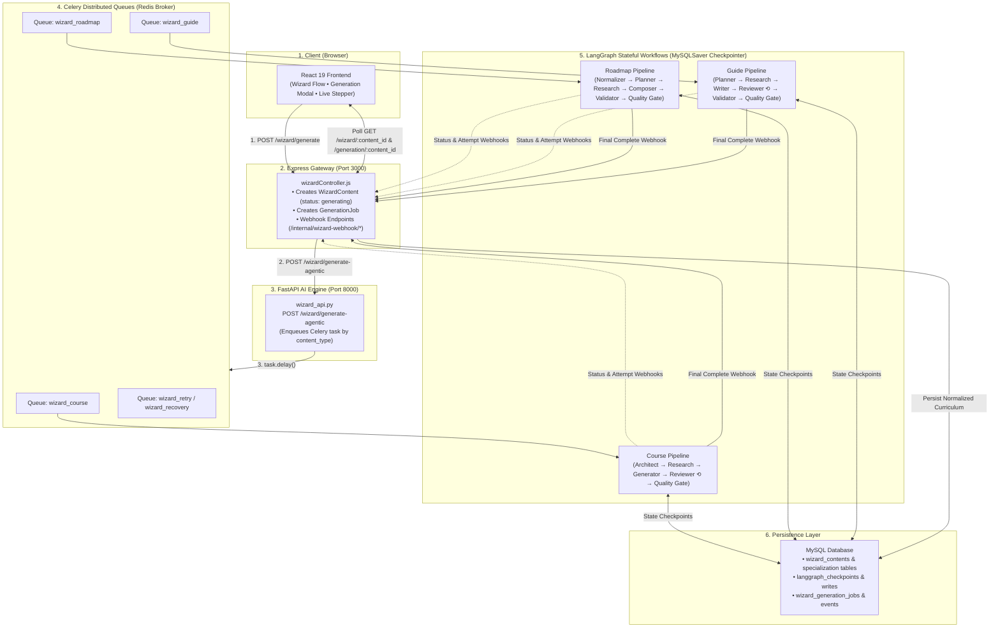
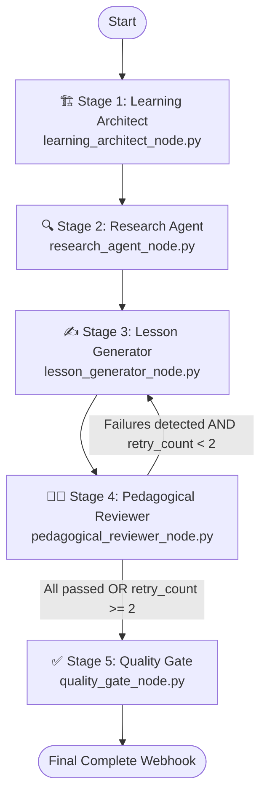
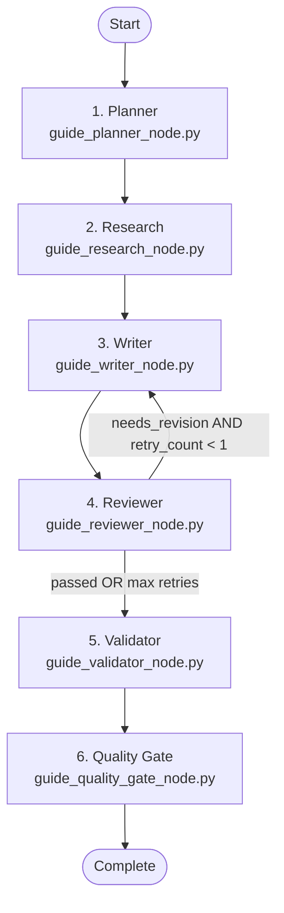
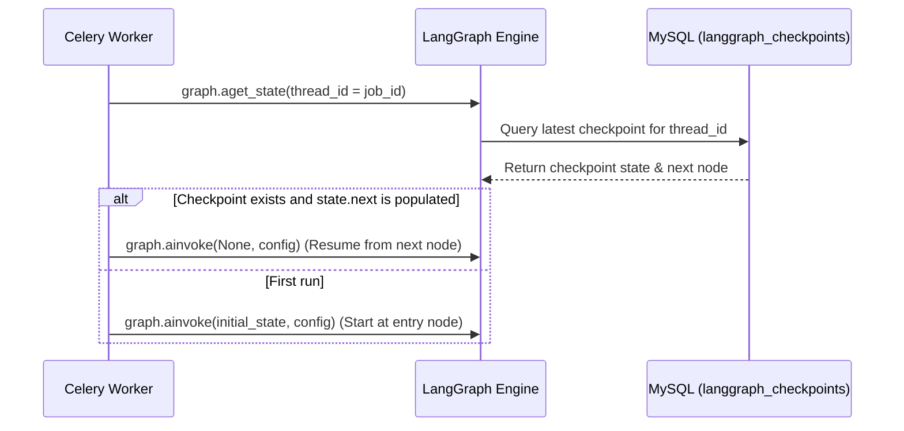
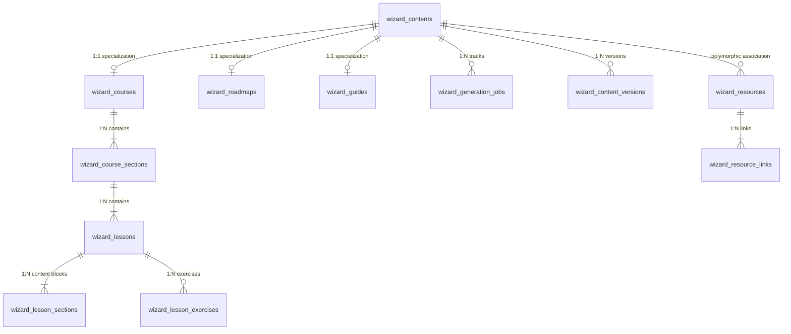

# 🧙‍♂️ CognitiveWizard — AI Wizard Module: Architecture & Generation Flow

Technical documentation for the CognitiveWizard Multi-Agent Curriculum & Learning Content Generation Engine.

---

## 📋 Table of Contents

1. [Big Picture — What the Wizard Does](#1-big-picture--what-the-wizard-does)
2. [End-to-End System Architecture](#2-end-to-end-system-architecture)
3. [The Three Dedicated Agentic Pipelines](#3-the-three-dedicated-agentic-pipelines)
   - [3.1 Course Generation Pipeline (5 Stages + Pedagogical Retry)](#31-course-generation-pipeline-5-stages--pedagogical-retry)
   - [3.2 Roadmap Generation Pipeline (6 Stages)](#32-roadmap-generation-pipeline-6-stages)
   - [3.3 Guide Generation Pipeline (6 Stages + Educational Revision)](#33-guide-generation-pipeline-6-stages--educational-revision)
   - [3.4 Synchronous Evaluation Path (`/wizard/generate-raw`)](#34-synchronous-evaluation-path-wizardgenerate-raw)
4. [Distributed Execution & Celery Task Queues](#4-distributed-execution--celery-task-queues)
5. [Durable Checkpointing & Interruption Resumption](#5-durable-checkpointing--interruption-resumption)
6. [Real-Time Webhooks & Granular Event Subsystem](#6-real-time-webhooks--granular-event-subsystem)
7. [Normalized Relational Data Architecture](#7-normalized-relational-data-architecture)
8. [Export Services (Roadmap PDF Generation)](#8-export-services-roadmap-pdf-generation)
9. [Key Files & Schemas Reference](#9-key-files--schemas-reference)

---

## 1. Big Picture — What the Wizard Does

The **AI Wizard** transforms learner topics, goals, and style preferences into pedagogically sound, interactive educational curriculums. Rather than generating a single monolithic text block with one LLM call, the Wizard coordinates a team of specialized AI agents running on **LangGraph StateGraphs**:

1. **Architects & Planners** structure curriculum blueprints, chapters, phases, and learning objectives without writing prose.
2. **Research Agents** query live search APIs (Tavily) to gather verified references, official documentation, videos, and articles.
3. **Content Generators & Writers** expand blueprints into rich multi-section lessons, worked code examples, and practice exercises.
4. **Pedagogical Reviewers** evaluate drafted content against Bloom's taxonomy and academic criteria, issuing explicit passes or triggering focused retries.
5. **Quality Gates** validate structural schemas and assemble finalized courses into normalized relational databases.

---

## 2. End-to-End System Architecture



---

## 3. The Three Dedicated Agentic Pipelines

CognitiveWizard features three independent LangGraph generation pipelines tailored to specific learning formats.

```
Incoming Request (content_type)
        │
        ├─ "Course/Syllabus" ──► 5-Stage Pipeline (Celery: wizard_course)
        │                         Architect → Research → Generator → Reviewer ⟲ → Quality Gate
        │
        ├─ "Roadmap"         ──► 6-Stage Pipeline (Celery: wizard_roadmap)
        │                         Normalizer → Planner → Research → Composer → Validator → Quality Gate
        │
        └─ "Guide"           ──► 6-Stage Pipeline (Celery: wizard_guide)
                                  Planner → Research → Writer → Reviewer ⟲ → Validator → Quality Gate
```

---

### 3.1 Course Generation Pipeline (5 Stages + Pedagogical Retry)

**Graph Definition**: [`agents/graphs/course_generation_graph.py`](../server/py_server/agents/graphs/course_generation_graph.py)  
**Celery Task**: `generate_course_task` (queue: `wizard_course`)  
**Shared State**: [`CourseAgentState`](../server/py_server/agents/states/course_agent_state.py)



#### Stage 1 · Learning Architect (`learning_architect_node.py`)
- **Mission**: Designs the full curricular hierarchy (Course → Chapters → Modules → Lessons) and identifies domain taxonomy and exercise style.
- **Rules**: Produces **structural blueprints only** (`CourseBlueprintSchema`). Generates zero lesson prose, keeping this initial structural pass rapid and cost-effective.
- **Checkpoints**: Saves initial state to MySQL checkpoint store. Fires status webhook `generating_blueprint` (15% progress).

#### Stage 2 · Research Agent (`research_agent_node.py`)
- **Mission**: For each lesson in the blueprint, queries the Tavily Search API in parallel batches to find verified documentation, video lectures, and technical articles.
- **Output**: Generates a structured `EvidencePackageSchema` per lesson (`lesson_evidence` dict). Fires status webhook `generating_evidence` (40% progress).

#### Stage 3 · Lesson Generator (`lesson_generator_node.py`)
- **Mission**: Drafts the full lesson content in concurrent batches (`_LESSON_BATCH_SIZE = 2`) using task profile `course_lesson` (temperature 0.6, up to 6 144 tokens).
- **Structure**: Each lesson satisfies `CourseLessonSchema` and consists of typed sections:
  - `explanation` (Core concept exposition)
  - `example` (Concrete illustrative case)
  - `analogy` (Mental model / intuitive explanation)
  - `code` (Executable syntax in Python/JS when applicable)
  - `common_mistakes` (Frequent pitfalls and resolutions)
  - `summary` (Wrap-up key takeaways)
- **Practice Exercises**: Generates multi-paradigm exercises (`coding`, `calculation`, `case_study`, `analysis`, or `reflection`).
- **Resilience**: Features soft-failure handling per lesson—if a single lesson LLM call fails, it is flagged without terminating the entire course generation. On retry passes, only failing lessons are re-generated. Fires status webhook `generating_lessons` (65% progress).

#### Stage 4 · Pedagogical Reviewer (`pedagogical_reviewer_node.py`)
- **Mission**: Acts as an automated academic dean. Reviews lessons against a strict pedagogical checklist:
  1. Factual accuracy & absence of technical hallucinations.
  2. Direct coverage of stated learning objectives.
  3. Quality of exercises (conceptual reflection for theory lessons, code for technical lessons).
  4. Bloom's Taxonomy progression (Remember → Understand → Apply → Analyze).
- **Output**: Returns `LessonReviewSchema` with `review_status: "passed"` or `"failed"` and actionable improvement suggestions.
- **Conditional Retry Loop**:
  - If any lesson failed AND `retry_count < 2`, routes execution back to **Stage 3 (Lesson Generator)** with the reviewer's feedback for targeted re-generation.
  - If all passed or retries are exhausted, routes forward to Stage 5. Fires status webhook `reviewing_content` (85% progress).

#### Stage 5 · Quality Gate (`quality_gate_node.py`)
- **Mission**: Validates the complete course against an 80% passing threshold and packages all chapters, modules, and lessons into `CoursePackageSchema`.
- **Completion**: Dispatches the final payload to the JS server via `POST /internal/wizard-webhook/complete` (95% → 100% progress).

---

### 3.2 Roadmap Generation Pipeline (6 Stages)

**Graph Definition**: [`agents/graphs/roadmap_generation_graph.py`](../server/py_server/agents/graphs/roadmap_generation_graph.py)  
**Celery Task**: `generate_roadmap_task` (queue: `wizard_roadmap`)  
**Shared State**: [`RoadmapAgentState`](../server/py_server/agents/states/roadmap_agent_state.py)

```mermaid
flowchart LR
    Start([Start]) --> Normalizer["1. Normalizer<br/>input_normalizer_node.py"]
    Normalizer --> Planner["2. Planner<br/>roadmap_planner_node.py"]
    Planner --> Research["3. Research<br/>roadmap_research_node.py"]
    Research --> Composer["4. Composer<br/>roadmap_composer_node.py"]
    Composer --> Validator["5. Validator<br/>roadmap_validator_node.py"]
    Validator --> QGate["6. Quality Gate<br/>roadmap_quality_gate_node.py"]
    QGate --> End([Complete])
```



#### Stage 1 · Input Normalizer (`input_normalizer_node.py`)
- Canonicalizes learner parameters: validates non-empty topics, normalizes skill levels (`beginner`, `intermediate`, `advanced`), and default goals.

#### Stage 2 · Roadmap Planner (`roadmap_planner_node.py`)
- Uses task profile `roadmap_planner` (temperature 0.4, 3 000 tokens) to construct chronological learning phases, milestones, module objectives, and prerequisites adhering to `RoadmapPlanSchema`.

#### Stage 3 · Roadmap Research (`roadmap_research_node.py`)
- Invokes `reference_research_service` to gather authoritative documentation, courses, articles, YouTube videos, and visual diagram assets.

#### Stage 4 · Roadmap Composer (`roadmap_composer_node.py`)
- **Deterministic Assembly**: Merges the curriculum phases with research references and media assets into a unified `RoadmapSchema` draft. Requires **0 extra LLM tokens**.

#### Stage 5 · Roadmap Validator (`roadmap_validator_node.py`)
- Validates structural completeness against Pydantic schema. If minor structural errors occur (e.g., missing phase labels), applies automatic fallback repair routines.

#### Stage 6 · Roadmap Quality Gate (`roadmap_quality_gate_node.py`)
- Performs final phase count verification, records stage checkpoint in MySQL, and publishes the completion event.

---

### 3.3 Guide Generation Pipeline (6 Stages + Educational Revision)

**Graph Definition**: [`agents/graphs/guide_generation_graph.py`](../server/py_server/agents/graphs/guide_generation_graph.py)  
**Celery Task**: `generate_guide_task` (queue: `wizard_guide`)  
**Shared State**: [`GuideAgentState`](../server/py_server/agents/states/guide_agent_state.py)



#### Stage 1 · Guide Planner (`guide_planner_node.py`)
- Builds the blueprint outline (`GuidePlanSchema`): module sequence, prerequisite tools required, and realistic reading/practice duration estimates.

#### Stage 2 · Guide Research (`guide_research_node.py`)
- Gathers official documentation and reference links for the specific tools and topics.

#### Stage 3 · Guide Writer (`guide_writer_node.py`)
- Expands every module into detailed practitioner content: step-by-step technical instructions, code examples, best practice tips, and common pitfalls (`GuideSchema`).

#### Stage 4 · Educational Reviewer (`guide_reviewer_node.py`)
- Evaluates clarity score (0.0 to 1.0) and actionability. If clarity is insufficient and `retry_count < 1`, routes back to the Guide Writer with specific improvement prompts.

#### Stage 5 · Guide Validator (`guide_validator_node.py`)
- Enforces strict Pydantic compliance and automatically computes reading time estimates.

#### Stage 6 · Guide Quality Gate (`guide_quality_gate_node.py`)
- Marks completion in the checkpointer and dispatches the final payload to the JS server.

---

### 3.4 Synchronous Evaluation Path (`/wizard/generate-raw`)

Located in [`api/wizard_api.py`](../server/py_server/api/wizard_api.py), `POST /wizard/generate-raw` executes synchronously and blocks until generation finishes:

- **Purpose**: Preserved for standalone evaluation, CLI tools, and automated pytest suites without requiring a running Redis broker or Celery worker pool.
- **Concurrent Roadmap Generation**: For roadmaps, uses `asyncio.gather()` to run the reference retriever agent (`compiled_reference_graph`) concurrently with the LLM generator, merging curated links into the returned payload.

---

## 4. Distributed Execution & Celery Task Queues

All production generation requests dispatch asynchronously through Celery workers backed by a Redis broker.

### Queue Isolation Architecture
To prevent long-running course generations from starving fast roadmap or guide requests, Celery maintains isolated priority queues:

| Task Name | Queue Name | Timeout Limits | Concurrency / Purpose |
| :--- | :--- | :--- | :--- |
| `tasks.wizard_tasks.generate_course_task` | `wizard_course` | Soft: 600s, Hard: 900s | Multi-chapter deep courses with lesson batching. |
| `tasks.wizard_tasks.generate_roadmap_task` | `wizard_roadmap` | Soft: 180s, Hard: 300s | Milestone curriculums and phase roadmaps. |
| `tasks.wizard_tasks.generate_guide_task` | `wizard_guide` | Soft: 240s, Hard: 360s | Practical how-to guides and tutorials. |
| `tasks.wizard_tasks.retry_job_task` | `wizard_retry` | Standard | Manual or automated retry dispatch. |
| `tasks.wizard_tasks.recover_jobs_task` | `wizard_recovery`| Periodic / Startup | Scans and resumes abandoned jobs. |

---

## 5. Durable Checkpointing & Interruption Resumption

To prevent wasted LLM tokens and ensure zero data loss during server restarts or worker crashes, every LangGraph workflow integrates with a durable **MySQLSaver** checkpointer.



### Key Resumption Features:
- **Zero Duplicate Inference**: If a worker terminates during Stage 3 (Lesson Generator), upon restart the job resumes directly at Stage 3 or 4 without re-running Stage 1 (Architect) or Stage 2 (Research).
- **Automated Recovery Service**: [`generation_recovery_service`](../server/py_server/services/generation/recovery_service.py) automatically scans for jobs stuck in `running` status after system boot, inspects their MySQL checkpoint, and re-enqueues them.
- **Manual Retry API**: `POST /wizard/generation/{job_id}/retry` re-dispatches interrupted jobs dynamically.

---

## 6. Real-Time Webhooks & Granular Event Subsystem

The Python agent pipeline publishes granular progress updates to Express (`server/js_server/controllers/wizardController.js`) via HTTP webhooks:

### Webhook Endpoints & Stages

| Webhook Route | Payload Key | Stage / Meaning | Progress |
| :--- | :--- | :--- | :---: |
| `/internal/wizard-webhook/status` | `status: "queued"` | Job received in Celery queue | 5% |
| `/internal/wizard-webhook/status` | `status: "generating_blueprint"` | Learning Architect designing structure | 15% |
| `/internal/wizard-webhook/status` | `status: "blueprint_ready"` | Blueprint validated against schema | 25% |
| `/internal/wizard-webhook/status` | `status: "generating_evidence"` | Research Agent querying Tavily | 40% |
| `/internal/wizard-webhook/status` | `status: "generating_lessons"` | Generator drafting lessons in batches | 65% |
| `/internal/wizard-webhook/status` | `status: "reviewing_content"` | Pedagogical Reviewer assessing lessons | 85% |
| `/internal/wizard-webhook/status` | `status: "quality_check"` | Quality Gate verifying pass ratio | 95% |
| `/internal/wizard-webhook/complete` | `status: "completed"` | Assembled payload saved to relational DB | 100% |
| `/internal/wizard-webhook/event` | Granular event tracking | Step-by-step progress logging | Dynamic |
| `/internal/wizard-webhook/attempt`| Diagnostic metrics | Records latency, provider, and model name | Diagnostics |

The frontend polls `GET /wizard/generation/:content_id` to render the real-time generation stepper and status label.

---

## 7. Normalized Relational Data Architecture

Once generation finishes, Express handles `POST /internal/wizard-webhook/complete` inside a database transaction, storing the content into normalized relational tables:



### Table Breakdown:
- **`wizard_contents`**: Central entity storing common metadata (`topic`, `title`, `content_type`, `status`, `skill_level`).
- **`wizard_courses`**: Course root metadata (`domain`, `domain_label`, `exercise_paradigm`).
- **`wizard_course_sections`**: Chapters and modules within a course.
- **`wizard_lessons`**: Lesson descriptors, overview, and sequence numbering.
- **`wizard_lesson_sections`**: Concrete content blocks (`explanation`, `example`, `code`, `analogy`, `common_mistakes`, `summary`).
- **`wizard_lesson_exercises`**: Interactive coding challenges, math calculations, and conceptual reflection questions.
- **`wizard_roadmaps` & `wizard_guides`**: Specialized storage for roadmaps and guides with milestone arrays and practical steps.
- **`wizard_resources` & `wizard_resource_links`**: Curated web sources, documentation, and video links.
- **`wizard_generation_jobs` & `events`**: Full execution audit trail with thread IDs, error details, and timing.

---

## 8. Export Services (Roadmap PDF Generation)

CognitiveWizard includes a dedicated PDF generation service:

- **Endpoint**: `POST /wizard/export-pdf`
- **Implementation**: [`services/roadmap_pdf_service.py`](../server/py_server/services/roadmap_pdf_service.py)
- **Features**:
  - Built with ReportLab using a custom `NumberedCanvas` for dynamic "Page X of Y" numbering.
  - Generates multi-phase tables with color-coded difficulty badges (`Beginner`, `Intermediate`, `Advanced`).
  - Embeds curated clickable hyperlinks for all research references (YouTube, documentation, articles).
  - Returns a binary stream directly downloadable as `{topic}_roadmap.pdf`.

---

## 9. Key Files & Schemas Reference

| File | Purpose |
| :--- | :--- |
| [`api/wizard_api.py`](../server/py_server/api/wizard_api.py) | FastAPI router for sync `/generate-raw`, async `/generate-agentic`, `/export-pdf`, and recovery endpoints. |
| [`tasks/wizard_tasks.py`](../server/py_server/tasks/wizard_tasks.py) | Celery task implementations for courses, roadmaps, guides, retries, and job recovery. |
| [`agents/graphs/course_generation_graph.py`](../server/py_server/agents/graphs/course_generation_graph.py) | LangGraph StateGraph wiring the 5-stage course generation pipeline and retry loop. |
| [`agents/graphs/roadmap_generation_graph.py`](../server/py_server/agents/graphs/roadmap_generation_graph.py) | LangGraph StateGraph wiring the 6-stage roadmap generation pipeline. |
| [`agents/graphs/guide_generation_graph.py`](../server/py_server/agents/graphs/guide_generation_graph.py) | LangGraph StateGraph wiring the 6-stage guide generation pipeline and revision loop. |
| [`schemas/course_generation.py`](../server/py_server/schemas/course_generation.py) | Pydantic v2 schemas: `CourseBlueprintSchema`, `CourseLessonSchema`, `LessonReviewSchema`, `CoursePackageSchema`. |
| [`schemas/roadmap_schema.py`](../server/py_server/schemas/roadmap_schema.py) | Pydantic v2 schemas: `RoadmapPlanSchema`, `RoadmapSchema`. |
| [`schemas/guide_schema.py`](../server/py_server/schemas/guide_schema.py) | Pydantic v2 schemas: `GuidePlanSchema`, `GuideReviewResultSchema`, `GuideSchema`. |
| [`core/mysql_checkpointer.py`](../server/py_server/core/mysql_checkpointer.py) | Custom LangGraph `MySQLSaver` persisting thread checkpoints to relational MySQL tables. |
| [`server/js_server/controllers/wizardController.js`](../server/js_server/controllers/wizardController.js) | Express controller handling generation initiation, status polling, and webhook database persistence. |

---

<div align="center">
  <sub>CognitiveWizard © 2026 — AI Powered Adaptive Learning Platform</sub>
</div>
